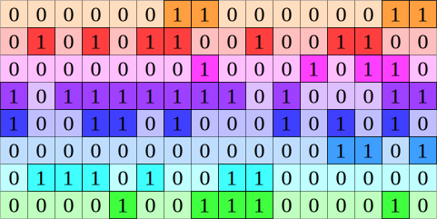
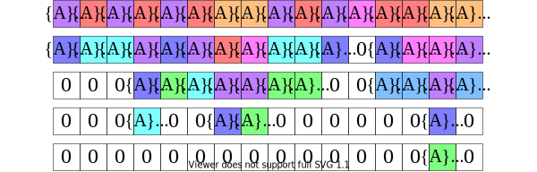

# Bitlet-PE
Bitlet: A bit-level sparsity-awared multiply-accumulate process element in HDL.

## Theory
Bitlet introduces a computing philosophy called "bit-interleaving", which would dig out all valid (non-zero) bit in Weights to minimize the number of sum operation, when calculating large scale multiply-accumulate (MAC).

In bit-interleaving method, valid bits of each significance will be distilled from Weights data, and corresponding Activations will be sum up togethor, as shown in the animation below (refresh if it does not work).

    
    <figcaption>
        Fig.1   Bit-interleaving: distill valid bits in W.
    </figcaption>
    
    <figcaption>
        Fig2.   Bit-interleaving: sum up corresponding A.
    </figcaption>

## Publication
This is the RTL source code of Bitlet-PE in conference paper MICRO'21: "Distilling Bit-level Sparsity Parallelism
for General Purpose Deep Learning Acceleration", [doi:10.1145/3466752.3480123](https://doi.org/10.1145/3466752.3480123).