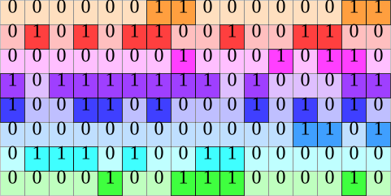
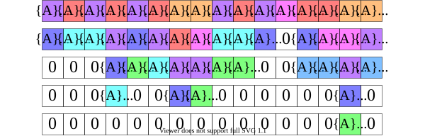

# Bitlet-PE
**Bitlet**: A bit-level sparsity-aware multiply-accumulate processing element in Verilog.

## Theory
Bitlet introduces a computing philosophy called "bit-interleaving", which identifies all valid (non-zero) bit in Weights to minimize the number of sum operations when calculating large-scale multiply-accumulate (MAC).

In the proposed bit-interleaving method, valid bits of each significance are distilled from Weights data, and corresponding Activations are summed togethor, as shown in the animations below (refresh if they do not work).

    
    <figcaption>
        **Fig.1** Bit-interleaving: distilling valid bits in Weights.
    </figcaption>
    
    <figcaption>
        **Fig.2** Bit-interleaving: summing up corresponding Activations.
    </figcaption>

## Publication
This is the source code of Bitlet-PE in our conference paper published in MICRO'21: "Distilling Bit-level Sparsity Parallelism for General Purpose Deep Learning Acceleration", [doi:10.1145/3466752.3480123](https://doi.org/10.1145/3466752.3480123).
